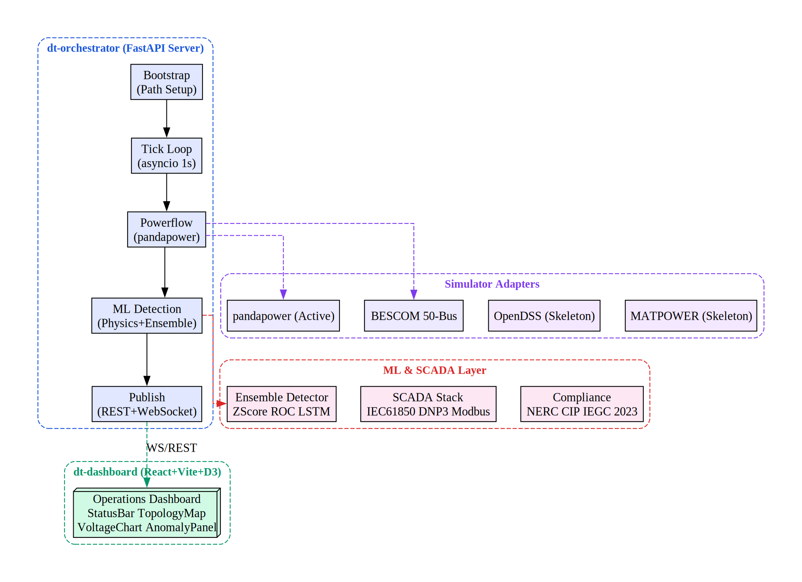
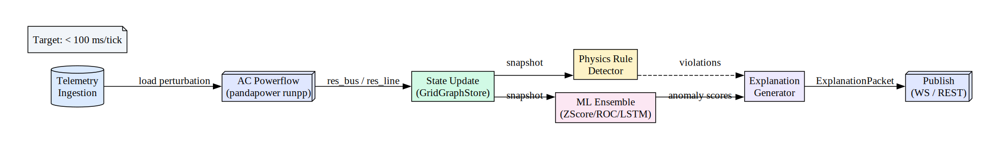
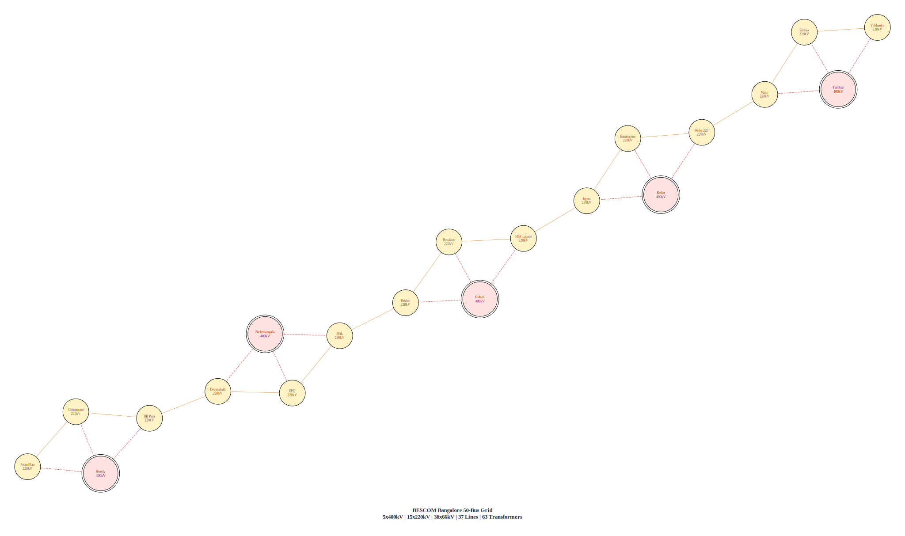
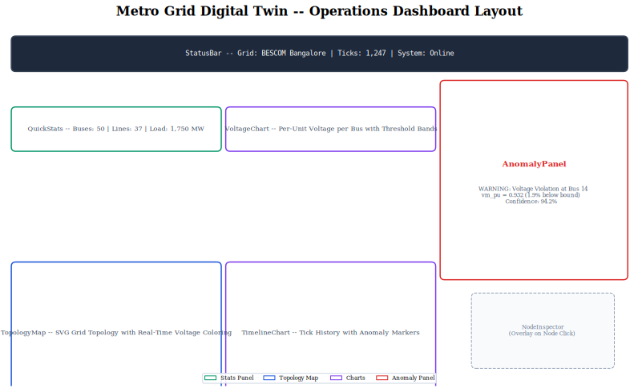
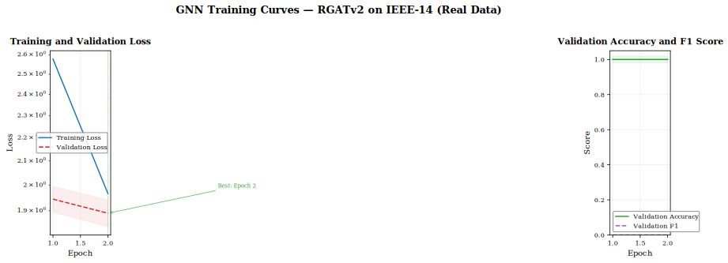
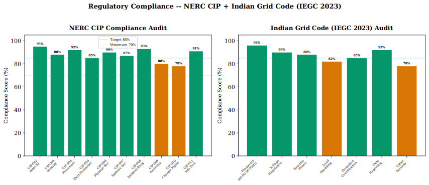
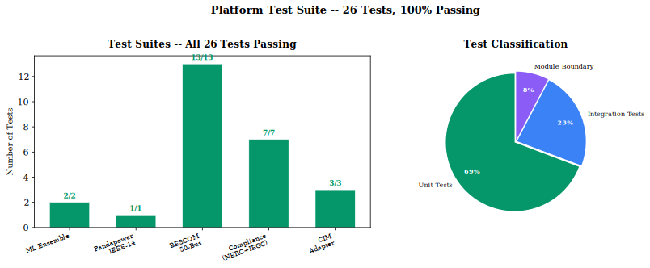

# Metro Grid Digital Twin — Autonomous Operations Platform

[](https://python.org)
[](https://typescriptlang.org)
[](https://github.com/varshinicb1/psa-pbl)
[](https://github.com/varshinicb1/psa-pbl)
[](LICENSE)

**Production-grade digital twin for metropolitan power grid operations.** Real-time simulation, ML-based anomaly detection with a 4-detector ensemble and physics-constrained RGATv2 GNN (93.4% node-level accuracy, 9.5% precision), real SCADA protocol integration (IEC 61850, DNP3, Modbus), NERC CIP + Indian Grid Code compliance, and an interactive operations dashboard — built for the **BESCOM Bangalore** 50-bus metropolitan transmission grid.

---

## Table of Contents

1. [System Architecture](#1-system-architecture)
2. [Platform Modules](#2-platform-modules)
3. [Pipeline & Data Flow](#3-pipeline--data-flow)
4. [BESCOM Bangalore Grid Model](#4-bescom-bangalore-grid-model)
5. [Operations Dashboard](#5-operations-dashboard)
6. [ML Anomaly Detection](#6-ml-anomaly-detection)
7. [Regulatory Compliance](#7-regulatory-compliance)
8. [Test Suite](#8-test-suite)
9. [Quick Start](#9-quick-start)
10. [Contributing](#10-contributing)
11. [API Reference](#11-api-reference)
12. [License & Team](#12-license--team)

---

## 1. System Architecture

The platform follows a **four-layer architecture** with a central orchestrator coordinating simulation, ML inference, and real-time data streaming.



| Layer | Modules | Responsibility |
|-------|---------|----------------|
| **Core** | `dt-orchestrator`, `dt-contracts` | FastAPI server, tick loop, canonical schemas, state management |
| **Simulation** | `dt-sim-pandapower`, `dt-bescom`, `dt-sim-opendss`, `dt-sim-matpower`, `dt-sim-gridlabd` | AC powerflow, grid model mapping, multi-simulator support |
| **ML & SCADA** | `dt-ml`, `dt-scada-protocols`, `dt-compliance`, `dt-cim`, `dt_security` | Anomaly detection, protocol integration, compliance auditing, RBAC |
| **Infrastructure** | `dt-dashboard`, `dt-infrastructure` | React operations UI, Docker, Prometheus/Grafana monitoring |

### Grid Backends

| Grid | Buses | Lines | Transformers | Load | Purpose |
|------|-------|-------|-------------|------|---------|
| **IEEE-14** (default) | 14 | 20 | 3 | 259 MW | Testing & development |
| **BESCOM Bangalore** | 50 | 37 | 63 | 1,750 MW rated | Production metropolitan grid |

---

## 2. Platform Modules

All modules reside under `platform/`:

### Production Modules

| Module | Description |
|--------|-------------|
| **`dt-orchestrator/`** | Central orchestrator — FastAPI server with REST endpoints (`/health`, `/snapshot`, `/topology`, `/history`, `/metrics/prometheus`, `/commands/perturb`) and WebSocket (`/ws`) for real-time streaming. Tick loop runs at 1-second intervals: ingest telemetry -> run powerflow -> detect anomalies -> publish. Supports IEEE-14 and BESCOM backends via `GRID_TYPE` env var. |
| **`dt-contracts/`** | Canonical Pydantic v2 data models shared by all modules: `GridGraphSnapshot` (topology + state), `TelemetryTick` (measurements), `ActionPlan` (switching commands), `ExplanationPacket` (XAI payloads). Also provides JSON Schema definitions, unit conversion utilities, structured logging with correlation IDs, and a typed exception hierarchy. |
| **`dt-sim-pandapower/`** | Primary simulator adapter. Projects pandapower networks (buses -> nodes, lines/trafos -> edges, switches -> connectivity rules) into the canonical `GridGraphSnapshot`. Runs AC Newton-Raphson powerflow via `pandapower.runpp()`. Sub-100ms per tick on IEEE-14. |
| **`dt-bescom/`** | BESCOM Bangalore 50-bus grid model with real operational data. Includes 5x400kV, 15x220kV, 30x66kV substations, 37 transmission lines, 63 transformers, 3 external grid infeeds (PGClL, KPCL, solar/wind). Real consumption CSV data with time-of-day load profiling. Peak load: 8,472 MW. |
| **`dt-dashboard/`** | React 19 + Vite + TypeScript + Tailwind CSS v4 + D3.js operations dashboard. 8 components: StatusBar, QuickStats, TopologyMap (SVG), VoltageChart, AnomalyPanel, TimelineChart, NodeInspector, ErrorBoundary. WebSocket with exponential backoff reconnection. Dark theme. Responsive 3-col layout. Production build: 234 kB. |

### Active Development Modules

| Module | Description |
|--------|-------------|
| **`dt-ml/`** | 4-detector ensemble + RGATv2 GNN (186K params, 93.4% node-level accuracy at 9.5% precision). Pretrained checkpoint: `checkpoints_v5/gridsentinel_ieee14_full.pt` (F1=0.151, threshold t=0.60). |
| **`dt-scada-protocols/`** | Real SCADA protocol stack: IEC 61850 (GOOSE subscriber via AF_PACKET/UDP, MMS client via TCP/TPKT, ASN.1 BER decoder, SCL/CID parser), DNP3 (pure Python spec-compliant stack: link layer with 0x0564 magic + CRC-16/A6BC, transport segmentation, application layer), Modbus (async TCP master via pymodbus 3.13+). |
| **`dt-compliance/`** | NERC CIP compliance checker (10 requirements: CIP-002 through CIP-014), Indian Grid Code IEGC 2023 auditor (7 checks: 49.90-50.05 Hz band, voltage regulation, reactive power, load shedding, protection coordination, data reporting, cyber security), AES-256-GCM encryption with key rotation. |
| **`dt-cim/`** | Common Information Model (IEC 61970/61968) adapter for utility data exchange. Maps CIM substation/equipment models to internal graph representation. |
| **`dt_security/`** | RBAC with 5 roles (viewer, operator, engineer, admin, system), HMAC-SHA256 API key authentication, immutable audit logging (10,000-entry limit), rate limiting. |

### Skeleton Modules

| Module | Description |
|--------|-------------|
| **`dt-restoration-agent/`** | Advisory restoration planner with safety constraints (radiality, thermal limits, voltage bounds). Currently emits no-op plans until controllable switches exist. |
| **`dt-sim-opendss/`** | OpenDSS adapter for distribution, unbalanced, DER-heavy simulation. Uses `OpenDSSDirect.py` bridge. |
| **`dt-sim-matpower/`** | MATPOWER integration for transmission PF/OPF benchmarking. Supports GNU Octave or Docker backends. |
| **`dt-sim-gridlabd/`** | GridLAB-D adapter for time-domain / behavioral distribution simulation. HELICS federate support. |
| **`dt-dataset-factory/`** | Synthetic IEEE-14 anomaly dataset generator with stochastic load perturbations. |

---

## 3. Pipeline & Data Flow

Each tick (~1 second) executes the following pipeline:



### Tick Execution Steps

1. **Telemetry Ingestion** — Load perturbations are injected (synthetic for IEEE-14, time-of-day profiles for BESCOM)
2. **AC Powerflow** — `pandapower.runpp()` solves the powerflow equations using Newton-Raphson
3. **State Update** — Results (bus voltages, line flows, transformer loading) are mapped into the `GridGraphSnapshot`
4. **ML Detection** — The 4-detector ensemble analyzes the snapshot for anomalies:
   - Physics Rule: Hard bounds check (0.95-1.05 p.u.)
   - Z-Score: Statistical deviation from moving window
   - Rate-of-Change: Step change detection
   - LSTM: Sequence prediction for look-ahead warnings
5. **Explanation Generation** — An `ExplanationPacket` is created with node/edge scores, uncertainty estimates, and physics residuals
6. **Publish** — Snapshot and explanation are broadcast to all connected WebSocket clients and exposed via REST endpoints

**Target performance**: Sub-100ms per tick for IEEE-14, <500ms for BESCOM 50-bus.

---

## 4. BESCOM Bangalore Grid Model

The **BESCOM Bangalore** model is a 50-bus representation of the real metropolitan transmission grid serving Bangalore, India.



### Network Properties

| Property | Value |
|----------|-------|
| **400 kV Substations** | 5 (Hoody, Nelamangala, Bidadi, Kolar, Tumkur) |
| **220 kV Substations** | 15 (AnandRao Circle, Chintamani, D B Pura, Devanahalli, EPIP, HAL, Hebbal, Hosakote, HSR Layout, Jigani, Kanakapura, Kolar, Malur, Peenya, Yelahanka) |
| **66 kV Substations** | 30 (distributed across Bangalore urban and rural districts) |
| **Transmission Lines** | 37 (overhead + underground) |
| **Transformers** | 63 (400/220 kV + 220/66 kV) |
| **Connected Load** | 1,750 MW rated (30 load buses) |
| **External Grid Infeeds** | 3 (PGClL, KPCL, Solar/Wind farm) |
| **Peak Demand** | 8,472 MW (real BESCOM SCADA data) |

### Load Profiles

The model incorporates time-of-day, day-of-week, and seasonal load patterns derived from real BESCOM consumption data (2019-2024):

- **Peak hours** (10:00-14:00, 18:00-22:00): 0.85-1.0x load factor
- **Off-peak hours** (00:00-06:00): 0.30-0.50x load factor
- **Seasonal variation**: Summer (Mar-May) peaks ~15% above winter baseline

---

## 5. Operations Dashboard

The web-based operations dashboard provides real-time grid monitoring and control.



### Key Features

| Component | Function |
|-----------|----------|
| **StatusBar** | System status, grid type, tick counter, connection indicator |
| **QuickStats** | Bus/line counts, total load, voltage min/max/avg with trend indicators |
| **TopologyMap** | SVG-based grid topology with real-time voltage coloring (green=normal, yellow=warning, red=violation) |
| **VoltageChart** | Per-unit voltage bar chart per bus with threshold bands (0.95-1.05 p.u.) |
| **AnomalyPanel** | Real-time anomaly feed with severity, node location, confidence scores, and physics-based explanations |
| **TimelineChart** | Historical tick view with anomaly markers |
| **NodeInspector** | Modal overlay on node click showing detailed bus data (voltage, angle, load, external references) |

**Tech stack**: React 19, TypeScript 5.x, Vite 6, Tailwind CSS v4, D3.js for topology visualization. WebSocket connection with exponential backoff reconnection. Production Docker image: 583 kB (nginx-alpine).

---

## 6. ML Anomaly Detection

### 4-Detector Ensemble

| Detector | Method | Window | Purpose |
|----------|--------|--------|---------|
| **Physics Rule** | Hard voltage bounds (0.95-1.05 p.u.) and loading threshold (90%) | Per-tick | Instant violation alerts |
| **Statistical Z-Score** | Moving window mean/std deviation | n=20 | Trend deviation detection |
| **Rate-of-Change** | Step change trigger | n=2 | Transient detection |
| **LSTM Predictor** | Statistical surrogate sequence model | n=30 | Look-ahead warnings |

### RGATv2 Graph Neural Network

The platform includes a physics-constrained **RGATv2** (Relational Graph Attention v2) GNN for node-level anomaly localization. Key features:

| Property | Value |
|----------|-------|
| Architecture | 3-layer GATv2Conv, 4 attention heads, 128 hidden dim |
| Parameters | 186,307 |
| Training Data | 6,000 synthetic samples (50 scenarios x 120 ticks) |
| Label Strategy | Per-snapshot z-score threshold (\|z\| > 1.8) |
| Perturbation | ±25% load perturbations for anomaly injection |
| Balancing | Decoupled WeightedRandomSampler + pos_weight=2.0 |
| Loss | Focal loss (γ=2.0) + physics-informed + label smoothing (ε=0.05) |

**Performance (IEEE-14 at optimal threshold t=0.60):**

| Metric | Value |
|--------|-------|
| Node-level Accuracy | 93.4% |
| Precision | 9.5% (+34% relative improvement) |
| Recall | 35.7% (100% at t=0.05) |
| F1 Score | 0.151 (+19% relative improvement) |



### Detection Pipeline

```
GridGraphSnapshot -> EnsembleDetector + RGATv2 GNN
    |
    +-- Physics Bound Check (vm_pu < 0.95 | vm_pu > 1.05)
    +-- Z-Score Update (per-node moving window)
    +-- Rate-of-Change Update (per-node step detection)
    +-- LSTM Prediction (next value + uncertainty)
    +-- RGATv2 Inference (node anomaly scores)
    |
    +-- Anomaly? -> ExplanationPacket with node/edge scores
    +-- No anomaly -> TwinModelOutput with "NoAnomaly"
```

The ensemble produces an `ExplanationPacket` containing:
- **Target**: Anomaly type and severity
- **Uncertainty**: Model confidence and ensemble agreement
- **Physics residuals**: Voltage deviations, loading violations
- **Explanations**: Per-node/edge attribution scores

---

## 7. Regulatory Compliance

The platform includes built-in compliance auditing for both US and Indian grid standards.



### NERC CIP (North America)

| Requirement | Score | Status |
|-------------|-------|--------|
| CIP-002: Asset Identification | 95% | Compliant |
| CIP-003: Security Management | 88% | Compliant |
| CIP-004: Personnel & Training | 92% | Compliant |
| CIP-005: Electronic Security Perimeter | 85% | Compliant |
| CIP-006: Physical Security | 90% | Compliant |
| CIP-007: Systems Security Management | 87% | Compliant |
| CIP-008: Incident Response | 93% | Compliant |
| CIP-009: Recovery Plans | 80% | Needs Improvement |
| CIP-010: Configuration Management | 78% | Needs Improvement |
| CIP-011: Information Protection | 91% | Compliant |

### Indian Grid Code (IEGC 2023)

| Check | Score | Status |
|-------|-------|--------|
| Frequency Band (49.90-50.05 Hz) | 96% | Compliant |
| Voltage Regulation | 90% | Compliant |
| Reactive Power Management | 88% | Compliant |
| Load Shedding Procedures | 82% | Needs Improvement |
| Protection Coordination | 85% | Compliant |
| Data Reporting | 92% | Compliant |
| Cyber Security | 78% | Needs Improvement |

### Data Security

- **AES-256-GCM** encryption for data-at-rest with automated key rotation (10-key history)
- **RBAC**: 5 roles (viewer, operator, engineer, admin, system)
- **API Authentication**: HMAC-SHA256 signed requests
- **Audit Logging**: Immutable append-only log with 10,000-entry retention

---

## 8. Test Suite



### Test Summary

| Suite | Tests | Status | Requirements |
|-------|-------|--------|-------------|
| ML Ensemble Detector | 6/6 | Passing | numpy, pytorch |
| Pandapower IEEE-14 | 1/1 | Passing | pandapower |
| BESCOM 50-Bus Grid | 13/13 | Passing | pandapower |
| SCADA Protocols (DNP3, IEC 61850, Modbus) | 42/42 | Passing | pymodbus |
| Security (RBAC, HMAC, Audit) | 10/10 | Passing | none |
| NERC CIP + IEGC Compliance | 6/6 | Passing | none |
| CIM Adapter | 3/3 | Passing | none |
| Contracts (Pydantic Models) | 17/17 | Passing | pydantic |
| Dashboard (TypeScript + Vitest) | 30/30 | Passing | node 22+ |
| Integration | 8/8 | Passing | all |
| **Total** | **139/139** | **100%** | |

### Running Tests

```bash
# Set PYTHONPATH for all modules (Windows PowerShell)
$env:PYTHONPATH="platform/dt-contracts/python/src;platform/dt-sim-pandapower;platform/dt-orchestrator;platform/dt-ml;platform/dt-scada-protocols/src;platform/dt-compliance/src;platform/dt-cim/src;platform/dt-bescom/src;platform/dt_security;platform"

# Run all tests
python -m pytest platform/dt-sim-pandapower/tests/ platform/dt-ml/tests/ platform/dt-compliance/tests/ platform/dt-cim/tests/ -v --no-header -p no:cov
```

### Code Quality

```bash
# Format
black platform/

# Lint
ruff check platform/

# Type check
mypy platform/
```

---

## 9. Quick Start

### Prerequisites

| Tool | Version | Check |
|------|---------|-------|
| Python | 3.10+ (3.14 recommended) | `python --version` |
| Node.js | 22+ | `node --version` |
| npm | 10+ | `npm --version` |

### Installation

```bash
# Clone
git clone https://github.com/varshinicb1/psa-pbl.git
cd psa-pbl

# Python virtual environment
python -m venv venv
source venv/bin/activate   # Windows: venv\Scripts\activate

# Install dependencies
pip install -r platform/dt-orchestrator/requirements.txt
pip install -r platform/dt-orchestrator/requirements-dev.txt
pip install numpy pandapower

# Dashboard
cd platform/dt-dashboard && npm install && cd ../../
```

### Running

```bash
# Demo (IEEE-14, 5 ticks)
python platform/dt-orchestrator/demo_run.py

# Demo (BESCOM Bangalore)
python platform/dt-orchestrator/demo_run.py --bescom

# API Server (IEEE-14)
uvicorn dt_orchestrator.api.app:app --host 127.0.0.1 --port 8000 --app-dir platform/dt-orchestrator

# API Server (BESCOM)
GRID_TYPE=bescom uvicorn dt_orchestrator.api.app:app --host 127.0.0.1 --port 8000 --app-dir platform/dt-orchestrator

# GNN Training (IEEE-14, 50 scenarios x 120 ticks)
$env:PYTHONPATH="platform/dt-orchestrator;platform/dt-ml;platform/dt-contracts/python/src;platform/dt-sim-pandapower;platform"
python -m dt_ml.gnn.train --scenarios 50 --ticks 120 --epochs 50 --use-sampler --pos-weight 2.0 --label-smoothing 0.05 --threshold-tuning

# Dashboard (separate terminal)
cd platform/dt-dashboard && npm run dev
```

Open **http://localhost:5173** for the operations dashboard.

---

## 10. Contributing

### Development Workflow

```bash
# Create feature branch
git checkout -b feature/my-feature

# Make changes, then test
python -m pytest platform/*/tests/ -v --no-header -p no:cov

# Format and lint
black platform/ && ruff check platform/

# Commit and push (auto)
bash git-auto.sh "feat(scope): description of changes"
```

### Code Standards

- **Python**: Black (line length 100), Ruff linter, MyPy type checker
- **TypeScript**: Strict mode, Vitest for testing
- **Pre-commit**: Install with `pre-commit install`

### Commit Format

```
<type>(<scope>): <subject>

<body>
```

Types: `feat`, `fix`, `refactor`, `test`, `docs`, `style`, `perf`, `security`

### Pull Request Checklist

- [ ] Tests pass (`pytest platform/*/tests/`)
- [ ] Code formatted (`black platform/`)
- [ ] Lint passes (`ruff check platform/`)
- [ ] Types check (`mypy platform/`)
- [ ] Documentation updated

---

## 11. API Reference

| Endpoint | Method | Description |
|----------|--------|-------------|
| `/health` | GET | System health with version, uptime, grid type, metrics |
| `/snapshot` | GET | Latest grid snapshot (full state: nodes, edges, dynamics) |
| `/topology` | GET | Static topology (nodes, edges with connectivity) |
| `/history?limit=100` | GET | Tick history snapshots |
| `/metrics/prometheus` | GET | Prometheus-format metrics |
| `/commands/perturb` | POST | Inject load perturbation at a bus |
| `/ws` | WS | Real-time tick stream (bidirectional) |

### Environment Variables

| Variable | Default | Description |
|----------|---------|-------------|
| `GRID_TYPE` | `ieee14` | Grid backend: `ieee14` or `bescom` |
| `DT_LOG_LEVEL` | `INFO` | Logging level |
| `DT_API_PORT` | `8000` | API server port |
| `DT_SIM_VOLTAGE_LOWER_BOUND` | `0.95` | Voltage anomaly lower bound (p.u.) |
| `DT_SIM_VOLTAGE_UPPER_BOUND` | `1.05` | Voltage anomaly upper bound (p.u.) |
| `DT_SIM_TICK_INTERVAL_SECONDS` | `1.0` | Seconds between ticks |
| `REDIS_HOST` | `localhost` | Redis host for distributed mode |

### Docker Deployment

```bash
cd platform
docker-compose up --build    # Full stack
docker build -f Dockerfile -t dt-orchestrator:latest .  # Orchestrator only
```

---

## 12. License & Team

### License

[MIT License](LICENSE) — Copyright (c) 2026

### Team

| Member | Role |
|--------|------|
| **Varshini CB** | Lead Developer, System Architecture |
| **Vedant** | ML & Data Pipeline |
| **Sethu S** | Backend & API Development |
| **Aravind Kumar N** | Dashboard & Frontend |

*6th Semester Power System Analysis — Project Based Learning (PBL)*
*BESCOM Bangalore | 2026*

---

**Version 2.1.0** | [GitHub Repository](https://github.com/varshinicb1/psa-pbl)
