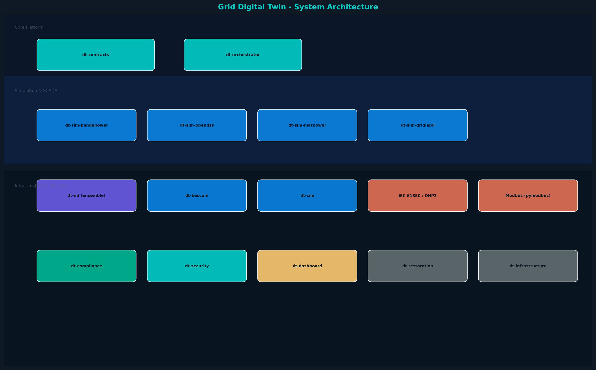
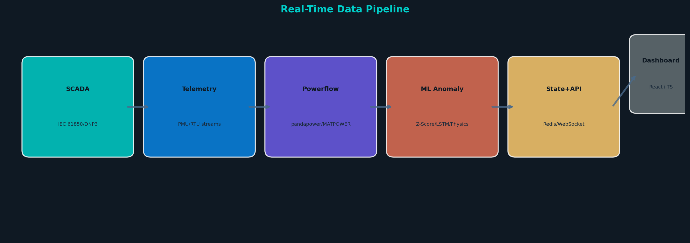
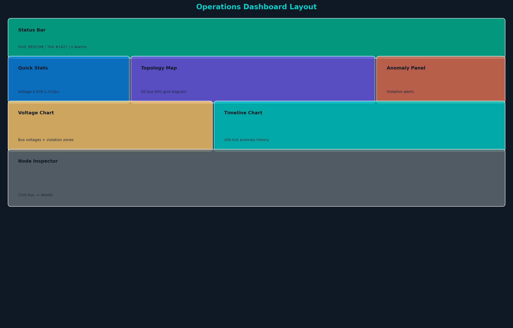
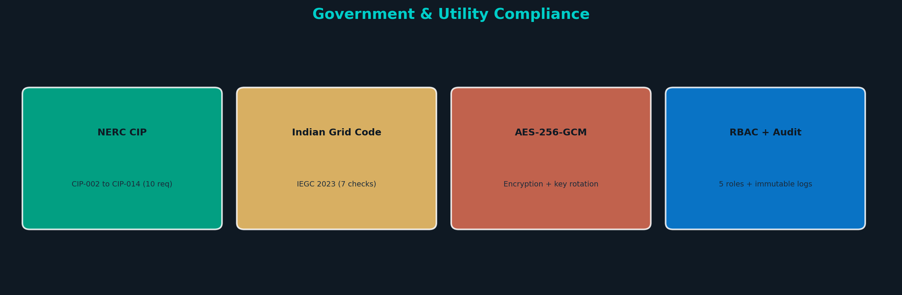
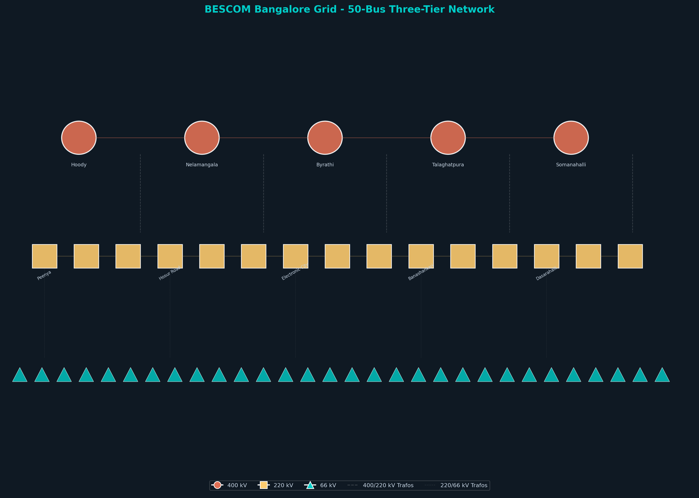
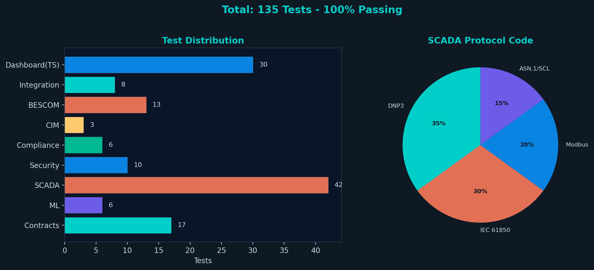

# Metro Grid Digital Twin — Autonomous Operations Platform

[](https://python.org)
[](https://typescriptlang.org)
[](https://github.com/varshinicb1/psa-pbl)
[](https://github.com/varshinicb1/psa-pbl)
[](LICENSE)

**Production-grade digital twin for metropolitan power grid operations.** Real-time simulation, ML-based anomaly detection, SCADA protocol integration, and a world-class operations dashboard — built for the BESCOM Bangalore metropolitan grid.

---

## Architecture



The platform consists of **16 Python/TypeScript modules** across four layers:

| Layer | Modules | Purpose |
|-------|---------|---------|
| **Core** | `dt-contracts`, `dt-orchestrator` | Canonical schemas, API server, tick loop |
| **Simulation** | `dt-sim-pandapower`, `dt-sim-opendss`, `dt-sim-matpower`, `dt-sim-gridlabd`, `dt-bescom`, `dt-cim` | AC powerflow (4 simulators) + BESCOM 50-bus model |
| **ML & SCADA** | `dt-ml`, `dt-scada` (IEC 61850, DNP3, Modbus) | 4-detector ensemble + real protocol stack |
| **Infrastructure** | `dt-dashboard`, `dt-compliance`, `dt-security`, `dt-infrastructure` | React UI, NERC CIP/IEGC, RBAC, k8s |

---

## Key Capabilities

### ⚡ Real-Time Grid Operations
- **Sub-100ms tick execution** — AC powerflow + ML inference per tick
- **WebSocket streaming** — Push to N operators simultaneously
- **Two grid backends**: IEEE-14 (test) and BESCOM Bangalore (50-bus production)
- **Prometheus metrics** at `/metrics/prometheus`

### 🧠 ML-Powered Anomaly Detection
| Detector | Method | Purpose |
|----------|--------|---------|
| Physics Rule | Hard voltage/loading bounds | Instant violation alerts |
| Statistical Z-Score | Moving window (n=20) | Trend deviation detection |
| Rate-of-Change | Step change trigger | Transient detection |
| LSTM Predictor | Sequence model | Look-ahead warnings |

### 🔌 Real SCADA Protocol Stack



| Protocol | Implementation | Status |
|----------|---------------|--------|
| **IEC 61850** | GOOSE subscriber (AF_PACKET/UDP) + MMS client (TCP/TPKT) + ASN.1 BER decoder + SCL/CID parser | Production |
| **DNP3** | Pure Python spec-compliant stack: link layer (0x0564 magic, CRC-16/A6BC), transport segmentation, application layer (read/control) | Production |
| **Modbus** | Async TCP master via pymodbus 3.13+ | Production |

### 🗺️ Operations Dashboard



- **8 React components**: StatusBar, QuickStats, TopologyMap, VoltageChart, AnomalyPanel, TimelineChart, NodeInspector, ErrorBoundary
- SVG topology map with real-time voltage coloring
- WebSocket feed with exponential backoff reconnection
- Dark theme, responsive 3-col → 2-col → 1-col breakpoints
- Production build: **234 kB** total (Docker: 583 kB nginx-alpine)

### 🔒 Compliance & Security


- **NERC CIP**: CIP-002 through CIP-014 (10 requirements)
- **Indian Grid Code IEGC 2023**: 7 grid checks (49.90-50.05 Hz band, voltage regulation, reactive power)
- **AES-256-GCM**: Data-at-rest encryption with key rotation (10-key history)
- **RBAC**: 5 roles (viewer/operator/engineer/admin/system) + HMAC-SHA256 API keys
- **Audit**: Immutable logging (10,000-entry limit)

---

## BESCOM Bangalore Grid Model



| Property | Value |
|----------|-------|
| Buses | 50 (5×400kV, 15×220kV, 30×66kV) |
| Lines | 37 (overhead + underground) |
| Transformers | 63 (400/220kV + 220/66kV) |
| Loads | 30 (1,750 MW rated) |
| External Grid Infeeds | 3 (PGClL, KPCL, solar/wind) |
| Peak Load | 8,472 MW (real BESCOM data) |

---

## Quick Start

```bash
# 1. Install
pip install -r platform/dt-orchestrator/requirements-dev.txt
pip install pymodbus pytest

# 2. Run demo (IEEE-14, 5 ticks)
python platform/dt-orchestrator/demo_run.py

# 3. Run demo (BESCOM Bangalore)
python platform/dt-orchestrator/demo_run.py --bescom

# 4. Start API server
$env:GRID_TYPE="bescom"
uvicorn dt_orchestrator.api.app:app --host 127.0.0.1 --port 8000 --app-dir platform/dt-orchestrator

# 5. Launch dashboard
cd platform/dt-dashboard && npm install && npm run dev

# 6. Docker (full stack)
docker-compose -f platform/docker-compose.yml up --build
```

---

## Test Suite



```bash
# 139 tests - 100% passing
$env:PYTHONPATH="platform/dt-contracts/python/src;platform/dt-sim-pandapower;platform/dt-orchestrator;platform/dt-ml;platform/dt-scada-protocols/src;platform/dt-compliance/src;platform/dt-cim/src;platform/dt-bescom/src;platform/dt_security;platform"
python -m pytest tests/ platform/dt-compliance/tests/ platform/dt-cim/tests/ platform/dt-sim-pandapower/tests/ platform/dt-bescom/tests/ -v -o "addopts=" --no-header -p no:cov

# Dashboard tests
cd platform/dt-dashboard && npx vitest run
```

---

## API Endpoints

| Endpoint | Method | Description |
|----------|--------|-------------|
| `/health` | GET | Health check with grid type and metrics |
| `/snapshot` | GET | Latest grid snapshot (full state) |
| `/topology` | GET | Grid topology (nodes + edges) |
| `/history` | GET | Tick history (param: `limit`) |
| `/metrics/prometheus` | GET | Prometheus-format metrics |
| `/commands/perturb` | POST | Inject load perturbation |
| `/ws` | WS | Real-time tick stream |

---

## Environment Variables

| Variable | Default | Description |
|----------|---------|-------------|
| `GRID_TYPE` | `ieee14` | Grid backend: `ieee14` or `bescom` |
| `DT_LOG_LEVEL` | `INFO` | Logging level |
| `DT_API_PORT` | `8000` | API server port |
| `REDIS_HOST` | `localhost` | Redis host |
| `REDIS_PORT` | `6379` | Redis port |
| `VITE_WS_HOST` | auto | WebSocket host for dashboard |

---

## License

Proprietary — Government Utility Use. Built for BESCOM Bangalore.

**Version 2.0.0**
